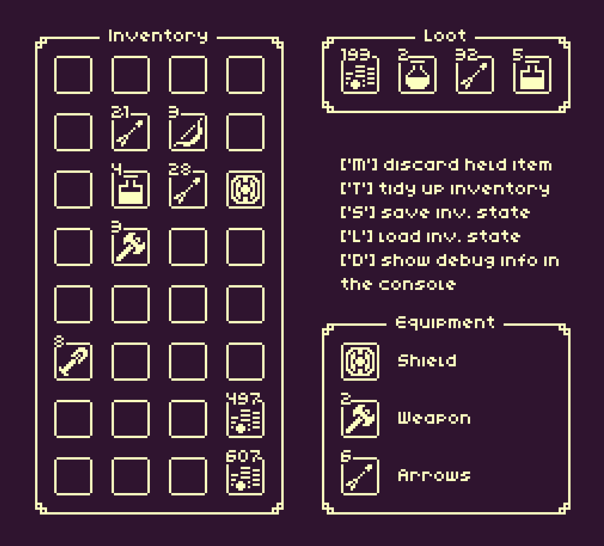

# Stash

> A general purpose inventory system for Game Maker Studio 2.3+

Stash is a general purpose inventory system focused purely on **storage and stack management**.  
It does not impose any visual representation or UI; all inventory data lives in structs and scripts, leaving display and interaction to the user.  

Stash takes a **bottom-up approach**: instead of a monolithic inventory struct / class, all the logic is contained in `StashStacks`, essentially inventory slots that keep track item / quantity pairs and are in charge of making sure all rules (either global or stack specific) are respected and consistent.

In this setup, an inventory is simply a regular array of `StashStacks`, hereafter referred to as a Stash.

## Features

- **Generic** – Does not enforce what an item is or how it is defined. Items can be strings, numbers, structs, or essentially anything.
- **Lightweight** – An inventory is just a simple array of stacks. No extra overhead; you can loop, sort, or reorganize it by leveraging the standard array functions and expressions.
- **Utility functions** – Manage your Stash array with a variety of helper functions for searching, sorting, counting and manage your inventory as a whole.
- **Events & Callbacks** – Built-in events let you run custom code whenever a stack’s state changes.
- **Custom rules** – Define rules for individual stacks or applied to the entire array of stacks to control behavior and constraints.

## Getting started

See the [Wiki](https://github.com/Homunculus84/Stash/wiki) for installation, usage examples, and API details.

---

  

